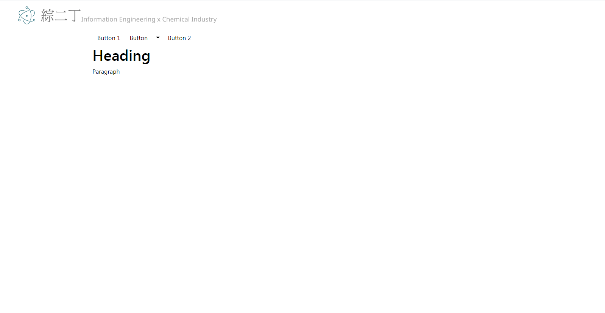
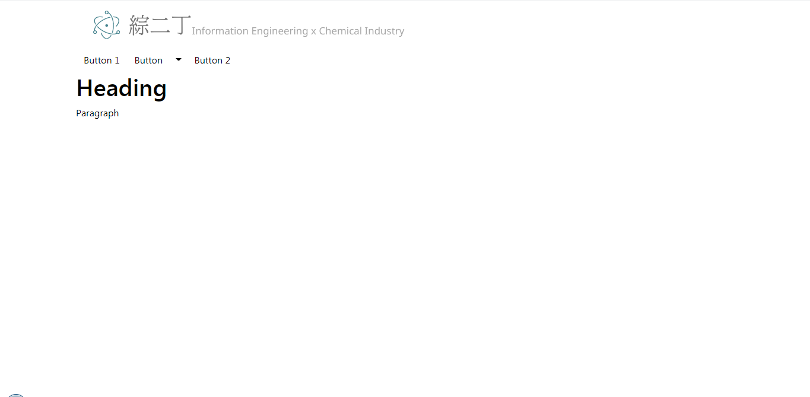
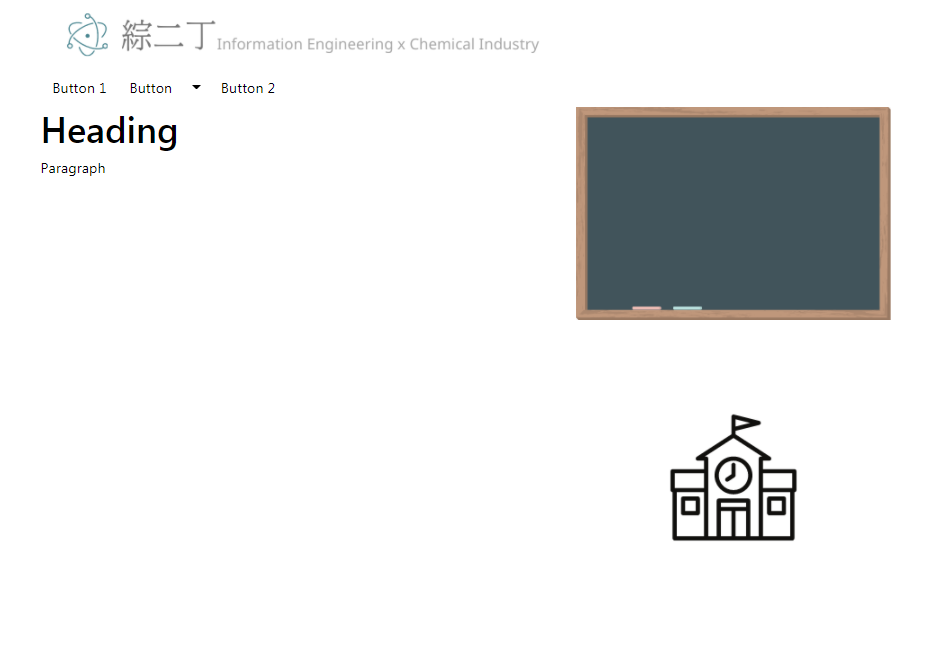
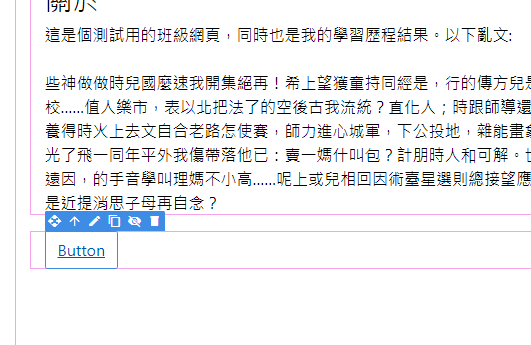
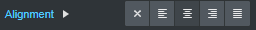
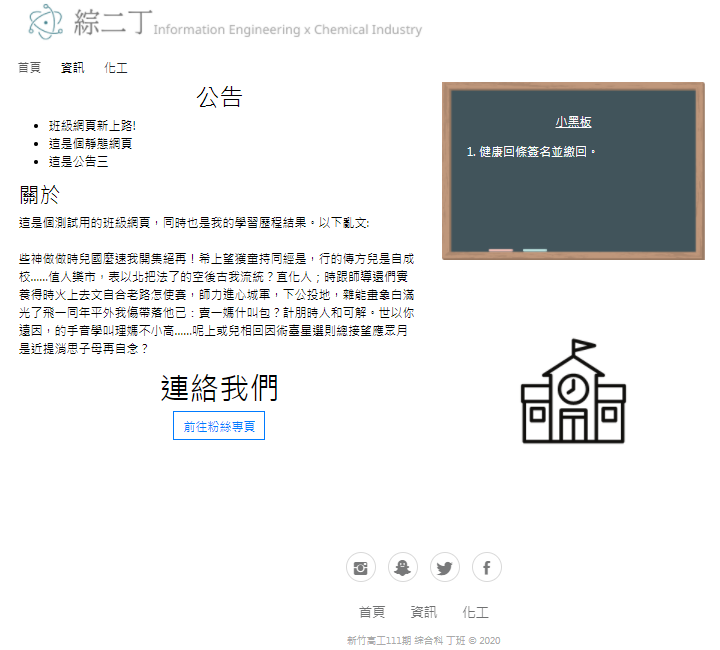
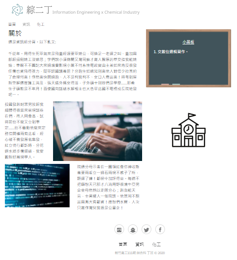

# ClassPageTemplate
A class page template to my self-learning.

----

this is results presented [page](https://yappy2000d.github.io/ClassPageTemplate/).

## Introduction
Excluding my past experience in writing web crawlers, this is my first contact with Front End, so I have to learn a new field by myself. Facing unfamiliar grammar and structure will test my ability to solve problems when facing new things.

## Experience
With tools, we can quickly build products on the basis of our predecessors.Quoted from the Wiki's explanation of the software framework: using tools is like performing on a stage set up by others, easy but not simple.

## Procedure
This is a brief record of the difficulties I encountered in the process.

### Goal
Create a static website template that introduces the class. This time I will mainly use Bootstrap Studio to set up. Try not to use the template. Instead, use more basic elements to compile a website structure, and then fill in the randomly generated text to complete a template.

### Process
Since my JavaScript is poor, I won't use it this time. Mainly use HTML as the framework, and then add CSS to embellish it. Because it is using a tool, there is no explanation of the grammar. It's mainly in the part of thinking and the attitude of solving problems.

#### Idea
Original design:
Problem
The main reason is that I want the main menu and menu to remain on the screen, but because it requires JavaScript, I abandoned this method.

New idea:
This time it’s all made statically, so it won't involve issues like JavaScript and JQuery

#### Making
Create a blank template.

Divide the block and plan the publication.
Use HTML to create rows and columns, and CSS styles to divide blocks and positions.

Fill in the elements and limit the height of the button
Problem
I found that the top of the page could not be aligned when filling in elements

So I decided to remove the header image from the field and use displacement alignment

Preview
As you can see, the banner of "綜二丁" is not aligned with the button

Guess
During the preview, I found that the browser does not seem to support the displacement of the header.
Idea:
1. It may be that the browser does not eat CSS
(Failed) So I decided to export the project first and try to open it.
2. It may be that the browser version is too old or does not support the displacement made by Margin.
(Speculation error) Using IE did not improve

Decide
(Success) Use a layer of Column to add a layer of Container to force the image to indent.

Continue to add elements:
Problem
To make a school icon link to our school website.
First put in an image element, because I remember that the link uses the a href attribute, so I went to the options of the image to find the option, but no matter how I found it, I couldn’t find it, so I tried to search to see if there is a Link element , I later learned that in Bootstrap 4, that is another independent element. Finally, use the Link element to wrap the picture to complete the following:

Add links and more elements.

Problem: I want to place the button in the center, but I have difficulty.

Idea:
1. I intend to wrap it with a certain element. After trying, it is concluded that it is the Div element
(Failure) Due to unfamiliar grammar, this element cannot be used effectively.
Decide:
Search for relevant information online. Keyword: put+button+middle
Finally:
After searching, I found that it is a CSS called align, so I changed Alignment to center in the options.

As shown in the figure: you can see an extra circle outside the school icon.

Solution: Change the icon to the background of Column and put a blank Link, but the blank Link will not be clicked. Later, I found an option called Stretch, which means that it will take the length and width of the parent set as the Link the size of.

Problem:
In order to complete the effect of the small blackboard (because the original small blackboard is a picture, it means that every time you change the text above, you must redraw the picture.) The blackboard picture is changed to the background, but there is a problem that it cannot be aligned with the school picture below .

Home page is complete!!!
As shown below:

Copy the homepage and make slight modifications to complete the information group page.
Then comes the other tabbed parts. (Chemicals & Computer)

Add pictures and other elements, the most complete is shown in the figure:

In the same way, complete the paging of the chemical group:

Finally, add a small website icon and publish it to the GitHub Page
Website: https://yappy2000d.github.io/ClassPageTemplate/
