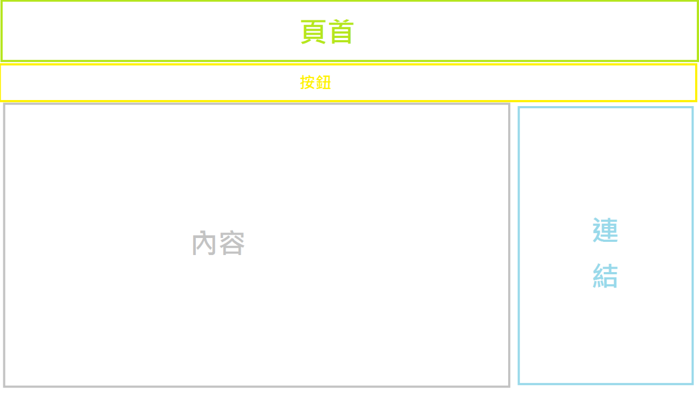

# ClassPageTemplate
A class page template to my self-learning.

----

this is results presented [page](https://yappy2000d.github.io/ClassPageTemplate/).

## Introduction
Excluding my past experience in writing web crawlers, this is my first contact with Front End, so I have to learn a new field by myself. Facing unfamiliar grammar and structure will test my ability to solve problems when facing new things.

## Experience
With tools, we can quickly build products on the basis of our predecessors.Quoted from the Wiki's explanation of the software framework: using tools is like performing on a stage set up by others, easy but not simple.

## Procedure
This is a brief record of the difficulties I encountered in the process.

### Goal
Create a static website template that introduces the class. This time I will mainly use Bootstrap Studio to set up. Try not to use the template. Instead, use more basic elements to compile a website structure, and then fill in the randomly generated text to complete a template.

### Process
Since my JavaScript is poor, I won't use it this time. Mainly use HTML as the framework, and then add CSS to embellish it. Because it is using a tool, there is no explanation of the grammar. It's mainly in the part of thinking and the attitude of solving problems.

#### Idea
Original design:
Problem
The main reason is that I want the main menu and menu to remain on the screen, but because it requires JavaScript, I abandoned this method.

New idea:
This time it’s all made statically, so it won't involve issues like JavaScript and JQuery

#### Making
Create a blank template.

Divide the block and plan the publication.
Use HTML to create rows and columns, and CSS styles to divide blocks and positions.

